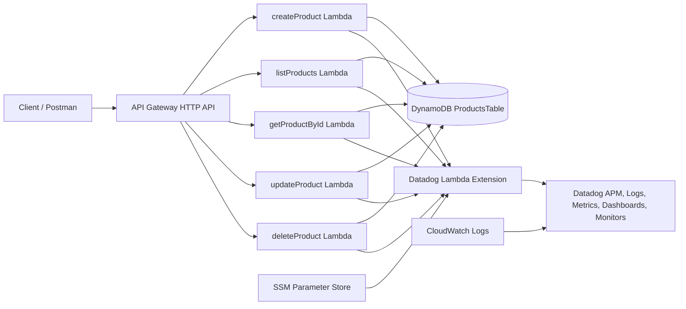

# Serverless Products API

A production-style TypeScript CRUD API deployed on AWS with Terraform and instrumented with Datadog for distributed tracing, structured log correlation, enhanced Lambda metrics, dashboards, and threshold-based monitoring.

The project began as a Serverless Framework application and was migrated to Terraform while preserving the existing DynamoDB table.

---

## Table of Contents

1. [Project Overview](#1-project-overview)
2. [Architecture](#2-architecture)
3. [Original Serverless Framework Implementation](#3-original-serverless-framework-implementation)
4. [Terraform Migration](#4-terraform-migration)
5. [AWS Resources Deployed](#5-aws-resources-deployed)
6. [Datadog Instrumentation](#6-datadog-instrumentation)
7. [Dashboard Metrics](#7-dashboard-metrics)
8. [Monitoring and Alerting](#8-monitoring-and-alerting)
9. [Security and Secret Management](#9-security-and-secret-management)
10. [Local Development](#10-local-development)
11. [Deployment Commands](#11-deployment-commands)
12. [Testing](#12-testing)
13. [Cleanup](#13-cleanup)
14. [Cost Controls](#14-cost-controls)

---

## 1. Project Overview

The API manages products through five serverless operations:

| Method | Route | Lambda function |
|---|---|---|
| `POST` | `/products` | `createProduct` |
| `GET` | `/products` | `listProducts` |
| `GET` | `/products/{id}` | `getProductById` |
| `PUT` | `/products/{id}` | `updateProduct` |
| `DELETE` | `/products/{id}` | `deleteProduct` |

### Core technologies

- TypeScript
- Node.js 22
- AWS Lambda
- Amazon API Gateway HTTP API
- Amazon DynamoDB
- Terraform
- AWS SDK for JavaScript v3
- esbuild
- Datadog APM and Serverless Monitoring
- AWS Systems Manager Parameter Store
- Amazon CloudWatch Logs

### Key outcomes

- Migrated infrastructure from the Serverless Framework to Terraform.
- Upgraded Lambda handlers to AWS SDK v3.
- Packaged each Lambda independently with esbuild.
- Added distributed tracing across API Gateway, Lambda, and DynamoDB.
- Correlated structured application logs with Datadog traces.
- Added enhanced Lambda metrics and a serverless observability dashboard.
- Added proactive latency, memory, and error-rate monitors.
- Stored the Datadog API key securely in AWS Systems Manager Parameter Store.
- Preserved the existing DynamoDB table outside Terraform ownership.

---

## 2. Architecture



### Request flow

```text
Client
  → API Gateway
  → Lambda handler
  → DynamoDB
  → Structured CloudWatch log
  → Datadog trace, enhanced metrics, dashboard, and monitors
```

### Project structure

```text
serverless-app/
├── src/
│   └── handlers/
│       ├── createProduct.ts
│       ├── listProducts.ts
│       ├── getProductById.ts
│       ├── updateProduct.ts
│       └── deleteProduct.ts
├── dist/
├── infra/
│   ├── api.tf
│   ├── dynamodb.tf
│   ├── iam.tf
│   ├── lambda.tf
│   ├── locals.tf
│   ├── logs.tf
│   ├── outputs.tf
│   ├── providers.tf
│   ├── variables.tf
│   └── versions.tf
├── package.json
├── package-lock.json
├── serverless.yml
├── tsconfig.json
└── README.md
```

Generated folders such as `dist/`, `infra/build/`, and `infra/.terraform/` are excluded from version control.

---

## 3. Original Serverless Framework Implementation

The original version used `serverless.yml` to define:

- Lambda functions
- API Gateway routes
- DynamoDB permissions
- Environment variables
- Deployment packaging
- CloudFormation-backed infrastructure deployment

The file is retained as a migration reference and a before-and-after comparison.

### Original deployment model

```text
serverless.yml
  → Serverless Framework
  → AWS CloudFormation
  → API Gateway, Lambda, IAM, and related resources
```

### Why migrate

The Terraform migration was completed to:

- Make infrastructure dependencies explicit.
- Improve resource-level visibility.
- Separate application packaging from infrastructure provisioning.
- Review planned changes before deployment.
- Manage IAM, logging, routes, and observability declaratively.
- Gain practical experience with Terraform state, providers, data sources, and dependency management.

The Serverless Framework configuration is no longer the primary deployment path.

---

## 4. Terraform Migration

Terraform configuration is located in the `infra/` directory.

### Migration approach

1. Modernize Lambda handlers to AWS SDK v3.
2. Build each handler with esbuild.
3. Package each compiled handler as an independent ZIP archive.
4. Reference the existing DynamoDB table through a Terraform data source.
5. Create the Lambda execution role and least-privilege policies.
6. Create five Lambda functions.
7. Create API Gateway integrations, routes, and Lambda permissions.
8. Create CloudWatch log groups with explicit retention.
9. Add Datadog Lambda layers and observability environment variables.
10. Grant the Datadog Extension access to the API key in Parameter Store.
11. Validate the deployment with Terraform, Postman, CloudWatch, and Datadog.

### Existing DynamoDB table

The table is intentionally referenced rather than managed:

```hcl
data "aws_dynamodb_table" "products" {
  name = "ProductsTable"
}
```

This design prevents `terraform destroy` from deleting the existing table.

### Lambda packaging

Each TypeScript handler is bundled with esbuild and packaged separately:

```text
src/handlers/createProduct.ts
  → esbuild
  → dist/createProduct.js
  → archive_file
  → infra/build/createProduct.zip
  → AWS Lambda
```

### Terraform safety checks

Before applying changes:

```bash
terraform -chdir=infra fmt -check
terraform -chdir=infra validate
AWS_PROFILE=personal terraform -chdir=infra plan
```

A safe plan should not unexpectedly replace Lambda functions or destroy the DynamoDB table.

---

## 5. AWS Resources Deployed

Terraform manages the following resources.

### API Gateway

- One API Gateway v2 HTTP API
- One default stage
- Five AWS proxy integrations
- Five routes
- Five Lambda invocation permissions

### Lambda

- `serverless-products-api-createProduct-dev`
- `serverless-products-api-listProducts-dev`
- `serverless-products-api-getProductById-dev`
- `serverless-products-api-updateProduct-dev`
- `serverless-products-api-deleteProduct-dev`

Each function uses:

- Node.js 22 runtime
- x86_64 architecture
- 256 MiB memory
- Datadog Node.js library layer
- Datadog Lambda Extension layer
- Environment-based service tagging
- A dedicated compiled ZIP artifact

### IAM

- Lambda execution role
- AWS-managed basic Lambda logging policy
- Inline DynamoDB access policy
- Inline SSM and KMS access policy for Datadog secret retrieval

### CloudWatch

- One log group per Lambda function
- Explicit log retention configured in Terraform

### DynamoDB

- Existing `ProductsTable`
- Referenced as a Terraform data source
- Not created, modified, or destroyed by this Terraform configuration

---

## 6. Datadog Instrumentation

The Lambda functions are instrumented with:

- Datadog Lambda Node.js library layer
- Datadog Lambda Extension
- Unified service tagging
- Distributed tracing
- Enhanced Lambda metrics
- Structured log forwarding
- Trace-to-log correlation

### Datadog environment variables

The deployment configures values similar to:

```text
DD_SERVICE=serverless-products-api
DD_ENV=dev
DD_VERSION=<application-version>
DD_SITE=<your-datadog-site>
DD_TRACE_ENABLED=true
DD_LOGS_ENABLED=true
DD_ENHANCED_METRICS=true
DD_CAPTURE_LAMBDA_PAYLOAD=false
```

The original application handler is preserved through:

```text
DD_LAMBDA_HANDLER=<compiled-handler>
```

The Datadog wrapper becomes the Lambda entry point and invokes the original handler internally.

### Secret retrieval

The Datadog API key is not stored in the repository or Terraform variables.

The Lambda Extension retrieves it from:

```text
/serverless-products-api/dev/datadog-api-key
```

through:

```text
DD_API_KEY_SSM_ARN
```

The ARN is constructed from the current AWS account and region without reading the secret value into Terraform state.

### Observability flow

```text
API Gateway request
  → Lambda invocation span
  → Application handler span
  → AWS SDK / DynamoDB span
  → Structured application log
```

A structured application log resembles:

```json
{
  "timestamp": "2026-07-13T02:58:30.004Z",
  "level": "info",
  "message": "Product created",
  "requestId": "example-request-id",
  "operation": "createProduct",
  "productId": "example-product-id"
}
```

Datadog injects trace and span identifiers into the Lambda log stream, allowing application logs to be opened from the associated trace.

### Troubleshooting note

During instrumentation, the Datadog Extension initially failed with an invalid HTTP header error.

The root cause was a malformed API-key value stored in Parameter Store. The issue was resolved by validating and sanitizing the key, overwriting the SecureString parameter, and restarting the Lambda execution environments.

---

## 7. Dashboard Metrics

The Datadog dashboard is named:

```text
Serverless Products API — Dev
```

It tracks the following operational metrics.

### Traffic

- Lambda invocations
- API requests
- API errors
- Request volume over time

### Performance

- Average Lambda runtime
- Runtime by Lambda function
- API latency percentiles
- Cold-start initialization duration

### Resource utilization

- Peak memory used by Lambda function
- Configured Lambda memory: 256 MiB

### Serverless behavior

- Cold-start count
- Datadog Extension post-runtime duration

### Cost

- Estimated Lambda invocation cost
- Displayed in micro-US dollars for readability

### Main enhanced metrics

```text
aws.lambda.enhanced.invocations
aws.lambda.enhanced.runtime_duration
aws.lambda.enhanced.init_duration
aws.lambda.enhanced.post_runtime_duration
aws.lambda.enhanced.max_memory_used
aws.lambda.enhanced.estimated_cost
```

### APM metrics

```text
trace.aws.lambda.hits
trace.aws.lambda.errors
trace.aws.lambda
```

The dashboard is intended for engineering analysis and demonstration. Metrics collected immediately after deployments may show a higher cold-start proportion than a steady production workload.

---

## 8. Monitoring and Alerting

Three Datadog threshold monitors provide proactive operational coverage across performance, reliability, and resource pressure.

### High p95 Lambda latency

```text
Monitor:    [Dev] Serverless Products API — High Lambda Latency
Scope:      env:dev, service:serverless-products-api
Metric:     p95 trace.aws.lambda latency
Evaluation: MAX over the last 1 hour
Warning:    above 750 ms
Critical:   above 1 second
```

Purpose:

- Detects degraded server-side latency.
- Directs investigation toward Lambda initialization, application runtime, DynamoDB, and downstream spans.
- Uses `Show last known status` because the development API is intentionally idle for long periods.

### High Lambda error rate

```text
Monitor:    [Dev] Serverless Products API — High Error Rate
Scope:      env:dev, service:serverless-products-api
Metric:     Lambda APM error rate
Evaluation: SUM over the last 1 hour
Warning:    above 5%
Critical:   above 10%
```

Purpose:

- Detects traces marked as server-side failures.
- Supports investigation through failed traces and correlated logs.
- Uses count-based APM evaluation, so Datadog requires `SUM`.

Low-traffic note:

One failed request among ten requests represents a 10% error rate. A production version should also require a minimum request count before triggering the percentage-based alert.

### High Lambda memory usage

```text
Monitor:    [Dev] Serverless Products API — High Lambda Memory Usage
Metric:     aws.lambda.enhanced.max_memory_used
Filter:     functionname:serverless-products-api-*
Group by:   functionname
Evaluation: MAX over the last 1 hour
Warning:    above 180 MiB
Critical:   above 205 MiB
Allocation: 256 MiB per function
```

Purpose:

- Detects memory pressure before functions approach their allocation.
- Evaluates all five Lambda functions independently.
- Inserts the triggering Lambda name into the notification through:

```text
{{functionname.name}}
```

### Monitor coverage

| Monitor | Operational concern | Grouping |
|---|---|---|
| High Lambda Latency | Performance degradation | Service-level |
| High Error Rate | Reliability failures | Service-level |
| High Lambda Memory Usage | Resource exhaustion | Per Lambda function |

### Notification testing

Each monitor can send a test notification through:

```text
Monitor → Edit → Test Notifications
```

For grouped monitors, select a specific `functionname` so message-template variables are populated.

The monitor suite complements the dashboard by converting telemetry into actionable thresholds instead of relying only on manual observation.

---

## 9. Security and Secret Management

### Datadog API key

The Datadog API key is stored as an AWS Systems Manager Parameter Store `SecureString`.

It must never be placed in:

- Git
- `terraform.tfvars`
- Committed environment files
- Screenshots
- Terraform outputs
- Documentation
- CI logs

### Least-privilege access

The Lambda role receives only the permissions required to retrieve the Datadog parameter:

```text
ssm:GetParameter
kms:Decrypt
```

The policy is scoped to the relevant SSM parameter and KMS key.

### Terraform state

Terraform state may contain infrastructure metadata and must not be committed.

Ignored files include:

```gitignore
node_modules/
.serverless/
dist/
infra/.terraform/
infra/build/
infra/tfplan
infra/*.tfplan
infra/*.tfstate
infra/*.tfstate.*
infra/terraform.tfvars
infra/*.auto.tfvars
```

The provider lock file should remain committed:

```text
infra/.terraform.lock.hcl
```

### Payload capture

Datadog request and response payload capture is disabled:

```text
DD_CAPTURE_LAMBDA_PAYLOAD=false
```

This reduces the risk of sending sensitive application payloads to the observability platform.

### Screenshot redaction

Before publishing screenshots, redact:

- AWS account IDs
- API keys and secret values
- Datadog account identity
- Personal email addresses
- Personal names where unnecessary
- Private API endpoints where appropriate

---

## 10. Local Development

### Prerequisites

- Node.js 22
- npm
- Terraform
- AWS CLI
- AWS credentials configured for the target account
- Access to the existing `ProductsTable`
- A Datadog account
- A valid Datadog API key stored in Parameter Store

### Install dependencies

```bash
npm install
```

### Type-check

```bash
npm run typecheck
```

### Build

```bash
npm run build
```

The build command:

- Cleans previous output
- Bundles all handlers with esbuild
- Targets Node.js 22
- Generates CommonJS Lambda bundles
- Produces source maps

### Validate AWS identity

Always verify the active AWS account before planning or applying:

```bash
AWS_PROFILE=personal aws sts get-caller-identity \
  --query '{Account:Account,Arn:Arn}' \
  --output table
```

### Verify the existing DynamoDB table

```bash
AWS_PROFILE=personal aws dynamodb describe-table \
  --table-name ProductsTable \
  --region ca-central-1
```

---

## 11. Deployment Commands

Run the commands from the repository root.

### Build the application

```bash
npm run typecheck
npm run build
```

### Initialize Terraform

```bash
AWS_PROFILE=personal terraform -chdir=infra init
```

### Format and validate

```bash
terraform -chdir=infra fmt
terraform -chdir=infra validate
```

### Review the plan

```bash
AWS_PROFILE=personal terraform -chdir=infra plan -out=tfplan
```

Inspect the saved plan:

```bash
terraform -chdir=infra show -no-color tfplan
```

Check for destructive changes:

```bash
terraform -chdir=infra show -no-color tfplan \
  | grep -E "will be destroyed|must be replaced"
```

### Apply

```bash
AWS_PROFILE=personal terraform -chdir=infra apply tfplan
```

### View outputs

```bash
terraform -chdir=infra output
```

### Confirm deployed Lambda configuration

```bash
AWS_PROFILE=personal aws lambda get-function-configuration \
  --function-name serverless-products-api-createProduct-dev \
  --region ca-central-1
```

### Verify no drift

```bash
AWS_PROFILE=personal terraform -chdir=infra plan
```

Expected:

```text
No changes. Your infrastructure matches the configuration.
```

---

## 12. Testing

### Postman workflow

A typical end-to-end test sequence is:

1. Create a product.
2. Store the returned product ID.
3. List all products.
4. Retrieve the product by ID.
5. Update the product.
6. Retrieve it again.
7. Delete it.
8. Confirm the product no longer exists.
9. Submit invalid input and verify the handled validation response.

### Example environment variables

```text
baseUrl=<Terraform API URL output>
productId=<ID returned by createProduct>
```

### Create product

```bash
curl -X POST "$BASE_URL/products" \
  -H "Content-Type: application/json" \
  -d '{
    "name": "Mechanical Keyboard",
    "description": "Wireless mechanical keyboard",
    "price": 89.99
  }'
```

### List products

```bash
curl "$BASE_URL/products"
```

### Get product

```bash
curl "$BASE_URL/products/$PRODUCT_ID"
```

### Update product

```bash
curl -X PUT "$BASE_URL/products/$PRODUCT_ID" \
  -H "Content-Type: application/json" \
  -d '{
    "name": "Mechanical Keyboard Pro",
    "description": "Updated product description",
    "price": 99.99
  }'
```

### Delete product

```bash
curl -X DELETE "$BASE_URL/products/$PRODUCT_ID"
```

### Validation test

```bash
curl -X POST "$BASE_URL/products" \
  -H "Content-Type: application/json" \
  -d '{
    "name": "",
    "price": -1
  }'
```

### CloudWatch verification

```bash
AWS_PROFILE=personal aws logs tail \
  /aws/lambda/serverless-products-api-createProduct-dev \
  --region ca-central-1 \
  --since 10m
```

A healthy instrumented invocation should show:

```text
TELEMETRY Name: datadog-agent State: Subscribed
EXTENSION Name: datadog-agent State: Ready
dd.trace_id=...
dd.span_id=...
Product created
```

### Datadog verification

Confirm the following:

- All five Lambda functions appear in APM.
- Full traces show API Gateway → Lambda → DynamoDB.
- Structured application logs are visible from the Lambda span.
- Enhanced Lambda metrics populate the dashboard.
- Latency, error-rate, and memory monitors evaluate as expected.
- No Datadog Extension crash appears in CloudWatch.

---

## 13. Cleanup

Preserve screenshots, README content, and article material before destroying resources.

### Preview destruction

```bash
AWS_PROFILE=personal terraform -chdir=infra plan -destroy
```

Review the plan carefully.

### Destroy Terraform-managed resources

```bash
AWS_PROFILE=personal terraform -chdir=infra destroy
```

### Resources that remain

The following resources are not destroyed automatically:

- `ProductsTable`, because it is referenced as a data source.
- The Datadog API-key parameter, if created manually outside Terraform.
- Datadog dashboards and monitors created manually in Datadog.
- AWS budgets and cost-anomaly monitors created outside this Terraform configuration.

### Remove the SSM parameter manually

Only after confirming it is no longer required:

```bash
AWS_PROFILE=personal aws ssm delete-parameter \
  --name "/serverless-products-api/dev/datadog-api-key" \
  --region ca-central-1
```

### Final verification

Review:

- AWS Lambda console
- API Gateway console
- CloudWatch log groups
- Systems Manager Parameter Store
- AWS Cost Explorer
- AWS Budgets
- Datadog integrations and trial settings

---

## 14. Cost Controls

This project is intended for low-volume learning and portfolio use.

### Controls used

- AWS Budget alerts
- Cost anomaly monitoring
- DynamoDB free-tier-aware usage
- Low-volume API testing
- Explicit CloudWatch log retention
- 256 MiB Lambda memory configuration
- Terraform-managed cleanup
- Datadog trial monitoring
- Manual removal of unused secrets

### Important notes

- AWS budget alerts are notifications, not hard spending caps.
- Datadog trial limits and retention policies should be reviewed before continued use.
- Lambda invocations, CloudWatch logs, API Gateway traffic, and Datadog ingestion can create charges.
- Destroy Terraform-managed resources when active testing is complete.
- Review the existing DynamoDB table separately because Terraform does not own it.


## Summary

This project demonstrates an end-to-end serverless engineering workflow:

```text
TypeScript development
  → esbuild packaging
  → Terraform planning
  → AWS deployment
  → API testing
  → distributed tracing
  → structured log correlation
  → enhanced metrics
  → operational dashboarding
  → threshold-based monitoring
  → cost-aware cleanup
```

It provides a practical example of migrating a working serverless application to Terraform while adding production-style observability, proactive alerting, and secure secret management.


> **Deployment status:** The AWS resources used for this demonstration have
> been destroyed to prevent ongoing cloud costs. The Terraform configuration
> remains available and can be used to reproduce the infrastructure.